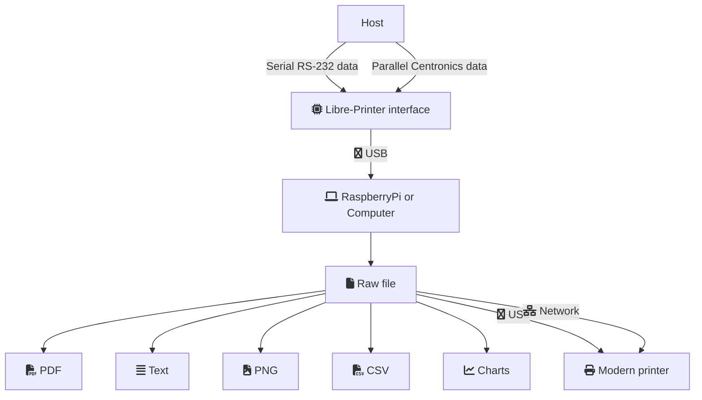
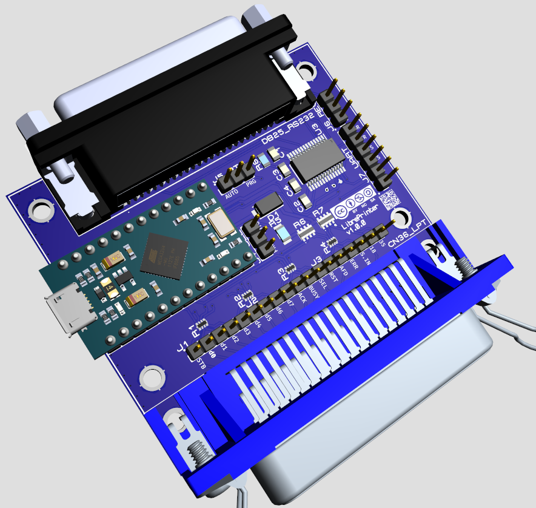

# Libre Printer

Libre Printer is a free reimplementation of the Retroprinter project and its proprietary interface.
The idea is to provide a software and hardware interfaces pretending to be a printer that is compatible
with old medical and industrial devices (machine tools).

Sometimes these devices cannot be replaced for cost reasons or simply because there is no justification to do so.
However, they often work in pairs with printers that are no longer manufactured and are often the weak point of
the installation because they are prone to breakdowns and the abandonment of the manufacture of their consumables.

## Documentation

Complete documentation about software & hardware is available
[online at readthedocs](https://libre-printer.readthedocs.io/en/latest/).

## Features

Libre-Printer consists of an Arduino interface and a set of programs designed to pretend
to be a Centronics parallel or serial printer. The data received is stored and/or redirected
to a modern printer connected via USB or the network.

The interface connects via USB to any computer or microcomputer such as a Raspberry Pi
(all models, including the Zero models).

The operation can be summarized in 3 key steps:

- Capture data from the sending machine;
- Rendering the data in plain text, PDF or image format;
- Redirection of the stream to a modern printer (e.g. network printer)

## Printer types & protocols supported

The supported interfaces & devices are the following:

- Epson printers:
    ESC/P - ESC/P2, 9 & 24 pins
- HP PCL printers:
    Any resolution and format (Ex: 150dpi, 300dpi, 600dpi), color or grayscale
    thanks to the project
    [GhostPCL](https://www.ghostscript.com/doc/9.53.3/WhatIsGS.htm#GhostPCL).
- HP-PGL (Pen Plotters), HP-GL/2-Compatible Instruments, Instruments with GPIB/HP-IB interfaces:
    HP 7470A plotter, oscilloscopes (Tektronix, HP), spectrum analyzers and signal analyzers.
    Thanks to the Free and Open Source Software:
    [hp2xx](https://www.gnu.org/software/hp2xx/).
- Seiko Quartz Watch Tester Printers:
    Specifically the Seiko Qt-2100 Timegrapher device.
    Thanks to our own project: [Seiko Converter](https://github.com/ysard/seiko_qt2100_converter).

Much more will come depending on the community's participation in terms
of funding, developing or sharing raw device output data for retroengineering purposes.

## Connectivity

Connections can be both serial RS-232 and parallel Centronics (DB-25 on one end, 36-pin Centronics on the other).

Note that most DB-25 cables (25 pins) with DB25 connectors at both ends are serial cables.
This was the RS-232 connector before the more compact DE-9 or erroneously called DB-9 (9-pin)
connectors were introduced in the 1980s, and sometimes for other purposes than a serial link
([cf. on Wikipedia: RS-232](https://fr.wikipedia.org/wiki/RS-232), [connecteurs D-sub](https://fr.wikipedia.org/wiki/D-sub)).

## Structure

### Hardware Interface

Instead of opting for an expensive, low scalability and reverse engineering hindering interface board
like the original project, it is cheap chips from the Arduino ecosystem.

Currently (and in a non-limited way) it is an Arduino ProMicro from Sparkfun, copies of which are
available on many resale sites.

This chip has enough pins to accommodate a parallel interface without an intermediate component, as well
as 2 RS-232 serial interfaces. One of the two serial interfaces is emulated on USB and allows the connection,
the exchanges and the update of the Arduino from a simple USB plug (we avoid the proprietary connectors
or the limited use of a RaspberryPi HAT).

### Software

The core software collecting the data interpreted by the interface can be executed on any machine running GNU/Linux.

It should be noted that the recent versions of the program converting ESC/P and ESC/P2 data are those
of the Retroprinter project, which has only been compiled for the ARM platform (i.e. Raspberry Pi).
However, we offer a slightly older (but functional) version of the converter that is compilable on all platforms.

## Why this project?

Why a competing project to RetroPrinter?

- Because we can.
- In short: This is an opportunity to have a better community project than the proprietary version.

### Technical considerations

The original software is not maintainable (close source), without decent software design and unnecessarily cumbersome.

- The ESC/P2 converter of retroprinter has a "free version" which besides being lightened of some features
(missing international charsets, etc.) is offered to be tested for free by the community and then to bring
patches in the paid version of their product...
- The "free version" is buggy and sometimes not compilable due to "patches"
(obviously applied with little testing).
- The documentation of the original programs is overloaded, poorly updated,
with redundant/overlapping parameters and sometimes non-functional combinations.
- The RetroPrinter interface is limited to a handful of platforms and cannot be a usable product
for most people without some investment (let's not forget that in **the last few years the prices of
RaspberryPi type boards have skyrocketed**!). Making the project compatible with all platforms is
both an economical and pragmatic choice for its diffusion

- LibrePrinter components are much cheaper/more affordable.
- We support serial printers without additional adapters.
- Multiple interfaces can be connected on the same computer!
- Our code is tested with over 90% coverage.

### Ethical considerations

Our solution is **truly** free: licensed under the AGPL.

It is common to see programs in C/C++ etc. developed not by expertise or by performance research,
but rather by a desire to obfuscate code at "lower cost". RetroPrinter is no exception to this.
Thus the "community" formed around these projects receives few benefits: slow development of patches,
lack of know-how for some tasks, paying products, no right to modify or redistribute the program, etc.
This behaviour is toxic because the community can neither audit nor improve the products.
The most paradoxical thing is that when the proprietary code leaks (and it always does) it becomes a competitor
to the original (Cf. [Streisand effect](https://fr.wikipedia.org/wiki/Effet_Streisand));
which is precisely what the authors wanted to avoid in the first place.

Finally, quite frankly, let's be pragmatic, the technologies of the 80's don't need the proprietary
and paying overlay of the 2022's... Let's hear it.

## Contributing

If you have a non-standard Centronics hardware or port you can open an issue on the
[project](https://github.com/ysard/libre-printer/issues)
and submit your problem to the Github community.

## License

Libre Printer is distributed under two licenses: one for community use and one for commercial use.

### Community = Free and Open Source

Libre Printer is released under the AGPL (Affero General Public License).

The hardware interface and its sources are published under a Creative Commons
License CC BY-NC-SA 4.0.

### Commercial

This is to limit the uses integrated in proprietary devices whose vendors would not participate in
the project in a fair way and who would otherwise be guilty of any violation of the Libre Printer
license as well as of the free software used by Libre Printer itself.

With such a license you maintain full ownership and control over your products,
while allowing you to distribute your products to customers as you wish.
You are not obligated to share your proprietary source code and this saves you from having to conform
to the requirements and restrictions of the AGPL.

To know the terms of this license we invite you to contact us.

