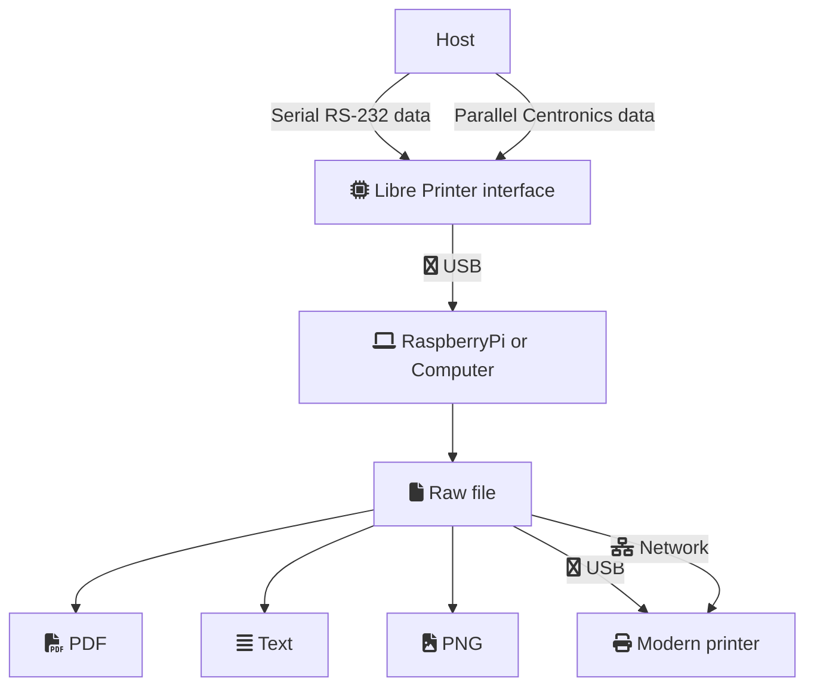

# Libre Printer

Libre Printer est une réimplémentation libre issue de l'étude du projet Retroprinter et de son interface propriétaire.
Il s'agit d'apporter une interface logicielle et matérielle se faisant passer pour une imprimante
compatible avec les anciens matériels médicaux et industriels (machine-outils).

Parfois ces appareils ne peuvent pas être remplacés pour des raisons de coût ou tout simplement
parce qu'il n'y a pas de justification de le faire. Ioutefois ils fonctionnent souvent
en couples avec des imprimantes qui ne se fabriquent plus et qui sont bien souvent
le point faible de l'installation car sujettes aux pannes et à l'abandon de la fabrication de leurs consommables.

## Documentation

La documentation complète pour le matériel et le logiciel est disponible en
[en ligne readthedocs](https://libre-printer.readthedocs.io/en/latest/).

## Fonctionnalités

Libre-Printer est composé d'une interface Arduino et d'un ensemble de programmes
conçus dans le but de se faire passer pour une imprimante parallèle dite "Centronics" ou Série.
Les données ainsi recues sont stockées et/ou redirigées vers une imprimante moderne
connectée en USB ou via le réseau.

L'interface se branche en USB à n'importe quel ordinateur ou micro-ordinateur tel
un Raspberry Pi (tous modèles, y compris les modèles Zero).

Le fonctionnement peut être résumé en 3 étapes clés :

- Capture des données en provenance de la machine émettrice;
- Rendu des données au format brut, simple texte, PDF ou image;
- Redirection du flux vers une imprimante moderne (imprimante réseau par ex)

## Types d'imprimantes & protocoles supportés

Les interfaces concernées sont les suivantes :

- Imprimantes Epson : ESC/P - ESC/P2, 9 & 24 pins
- Imprimantes HP PCL :
    Toute résolution et tout format (Ex: 150dpi, 300dpi, 600dpi), couleur ou nuance de gris
    Merci au projet [GhostPCL](https://www.ghostscript.com/doc/9.53.3/WhatIsGS.htm#GhostPCL).

## Connectique

La connectique peut être aussi bien série RS-232 que parallèle de type Centronics (DB-25 d'un côté,
Centronics à 36 broches de l'autre).

Notez que la plupart des câbles DB-25 (25 pins) avec des connecteurs DB25 aux 2 extrémités
sont des câbles série. C'était en effet la connectique standardisée de la norme RS-232 avant que
les connecteurs plus compacts DE-9 ou appelés à tort DB-9 (9 pins) n'aient été introduits dans les années 80;
par ailleurs parfois pour d'autres rôles qu'une liaison série ([cf. sur Wikipédia : RS-232](https://fr.wikipedia.org/wiki/RS-232),
[connecteurs D-sub](https://fr.wikipedia.org/wiki/D-sub)).

## Structure

### Interface physique

Au lieu d'opter vers une carte d'interface coûteuse, peu évolutive et freinant la rétro-ingénierie
comme le projet d'origine, il s'agit de puces bon marché de l'écosystème Arduino.

Il s'agit actuellement (et de manière non limitée) d'un Arduino ProMicro de chez Sparkfun dont des
copies sont disponibles sur de nombreux sites de revente.

Cette puce dispose de suffisamment de broches pour acueillir une interface parallèle sans composant
intermédiaire, ainsi que 2 interfaces série RS-232.
Une des deux interfaces série est émulée sur USB et permet le branchement, les échanges et la mise à jour de
l'Arduino depuis une simple prise USB (nous évitons les connecteurs propriétaires ou l'utilisation
limitée d'un HAT de RaspberryPi).

### Logiciel

Le coeur logiciel recueillant les données interprêtées par l'interface s'exécute sur n'importe
quelle machine sous GNU/Linux.

Il faut noter, les versions récentes du programme convertissant les données ESC/P et ESC/P2 sont celles
du projet Retroprinter qui n'a été compilé que sous plateforme ARM (i.e Raspberry Pi).
Nous proposons toutefois une version un peu plus ancienne (mais fonctionnelle) du convertisseur
qui est compilable sur toutes les plateformes.

## Pourquoi ce projet ?

Pourquoi un projet concurrent à RetroPrinter ?

- Parce que nous pouvons.
- En bref: C'est l'occasion d'avoir un projet de meilleure qualité que la version propriétaire.

### Raisons techniques

- Les logiciels originaux ne sont pas maintenables (close source), sans design logiciel décent et inutilement lourds.
- Le convertisseur ESC/P2 de retroprinter a une "version libre" qui en plus d'être allégée de certaines
fonctionnalités (charsets internationaux manquants, etc.)
est proposée pour être testée gratuitement par la communauté puis pour apporter des correctifs
dans la version payante de leur produit...
- La "version libre" est buggée et parfois non compilable au gré des "correctifs"
(appliqués manifestement avec peu de tests).
- La documentation des programmes d'origine est surchargée, mal mise à jour,
avec des paramètres redondants/opposés et dont la combinaison est parfois non fonctionnelle.
- L'interface RetroPrinter est limitée à une poignée de plateformes et ne peut être un produit
utilisable par le plus grand nombre sans un certain investissement (n'oublions pas que ces dernières
années **les prix des cartes de type RaspberryPi ont augmenté en flèche** !).
Rendre le projet compatible avec toutes les plateformes est un choix à la fois économique
et pragmatique pour sa diffusion

- Les composants de LibrePrinter sont nettement moins onéreux/plus abordables.
- Nous supportons les imprimantes série sans adaptateur supplémentaire.
- Notre code est testé avec une couverture supérieure à 90%.

### Raisons éthiques

Notre solution est **vraiment** libre : sous licence AGPL.

Il est fréquent de voir des programmes en C/C++ etc. développés
non par expertise ou par recherche de performances, mais plutôt par volonté d'obfusquer du code à "moindre frais".
RetroPrinter ne déroge pas à ce constat. 
Ainsi la "communauté" constituée autour de ces projets ne perçoit que peu de bénéfices :
lenteur de développement des correctifs, manque de savoir faire pour certaines implémentations, produits payants,
aucun droit à modifier ou redistribuer le programme, etc.
Ce comportement est toxique car la communauté ne peut ni auditer, ni améliorer les produits.
Le plus paradoxal est que le jour où le code propriétaire fuite (et il fuite toujours)
il devient concurrent de l'original (Cf. [effet Streisand](https://fr.wikipedia.org/wiki/Effet_Streisand));
ce qui est précisément ce que les auteurs voulaient éviter à l'origine.

Pour finir, très franchement gardons les pieds sur terre, les technologies des années 80
n'ont pas besoin des surcouches propriétaires et payantes des années 2022...
À bons entendeurs.

## Contribution

Si vous disposez d'un matériel ou d'un port centronics non standard vous pouvez
ouvrir une issue sur le [projet](https://github.com/ysard/libre-printer/issues)
et soumettre votre problème à la communauté Github.

## Licence

Libre Printer est diffusé sous deux licences : l'une communautaire et l'autre
à usage scommercial.

### Communautaire = Libre et Open Source

Libre Printer est diffusé sous licence AGPL (Affero General Public License).

### Commerciale

Il s'agit de limiter les usages intégrés dans des appareils propriétaires
dont les vendeurs ne participeraient pas au projet de manière équitable
et qui par ailleurs se rendraient
coupables d'une quelconque violation de la licence de Libre Printer ainsi que des logiciels
libres utilisés par Libre Printer lui-même.

Avec une telle licence, vous conservez la pleine propriété et le contrôle de vos produits,
tout en vous permettant de distribuer vos produits aux clients comme vous le souhaitez.
Vous n'êtes pas obligé de partager votre code source propriétaire, ce qui vous évite
d'avoir à vous conformer aux exigences et aux restrictions de l'AGPL.

Pour connaître les modalités de cette licence nous vous invitons à prendre
contact avec nous.

