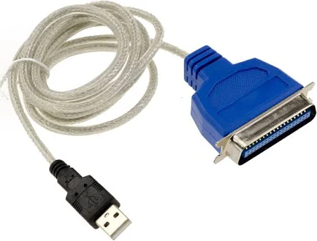
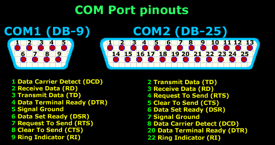
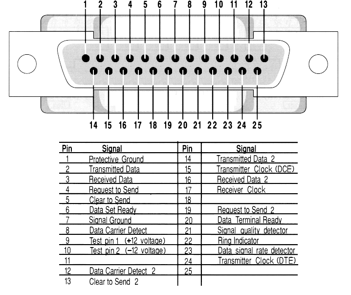
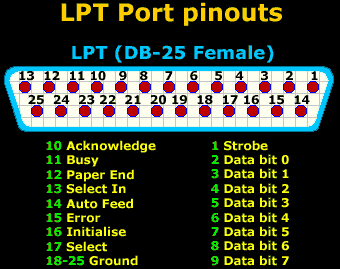
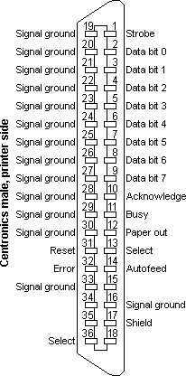

.. _faq:

***************************
Frequently asked questions
***************************

.. contents:: Summary
    :depth: 2
    :local:
    :backlinks: top

.. _usb_to_centronics_adapters:

About the USB/Centronics adapters
---------------------------------

   USB to Centronics Printer Adapter; Yes they can be used to test the interface.

They can be used to connect to a Centronics printer or to the |project_name| interface.
Provided that this port is configured as an ESC or PCL printer in CUPS.

See some examples of drivers for **Epson Dot Matrix & Stylus** printers,
and also for **HP Deskjet & LaserJet** PCL printers:

EPSON 9-pin Dot Matrix, epson9.ppd
    ESC/P, B/W, 60x72, 120x72, 240x72 dpi
EPSON 24-pin Dot Matrix, epson24.ppd
    ESC/P, B/W, 120x180, 180x180, 360x180, 360x360 dpi
EPSON Stylus Color, stcolor.ppd
    ESC/P2, B/W/CMYK, 180, 360, 720 dpi
EPSON Stylus Photo, stphoto.ppd
    ESC/P2, B/W/CMYK, 180, 360, 720 dpi
HP DeskJet, deskjet.ppd
    PCL, B/W/CMYK, 150, 300, 600 dpi
HP LaserJet, laserjet.ppd
    PCL, B/W, 150, 300, 600 dpi

These drivers are embeded in CUPS as you can see it on their
`repository <https://github.com/OpenPrinting/cups/#setting-up-printers>`_.

But you can also download them on this website:
`Openprinting Epson Dot Matrix <https://www.openprinting.org/printer/Epson/Epson-Dot_Matrix>`_.

About the support of the bridge with modern printers
----------------------------------------------------

|project_name| offers a way to forward the data to be printed to another printer.

The support of other printers can be a problem problem but
it's not the responsibility of the project because this part is
handled by CUPS and its embedded drivers on GNU/Linux distributions.
However, it should be noted that new printers are quickly supported
(within a few months) and that the standardization of GNU/Linux drivers has made
great progress in the last few years.

In the worst case manufacturers provide proprietary drivers for their machines.
Check this link for GNU/Linux compatible printers via CUPS:
`openprinting.org <http://www.openprinting.org/printers>`_.

Is the project compatible with RetroPrinter binaries?
-----------------------------------------------------

The project is designed as a drop-in replacement for RetroPrinter binaries.

It should be noted that (in 2021) of all their binaries only `convert-escp2`
(the Epson ESC instruction converter) is the one that is really useful.

The other executables are only used to move the print files or to perform minor
perform minor actions; they have all been reimplemented in the code of |project_name|.

You can reuse the `convert-escp2` executable from Retroprinter as is in the
provided disk image without moving it, as long as you enter its path in the
configuration file for |project_name| (`/etc/libre-printer/libreprinter.conf`).

You can also install the version we package for |project_name|.
Note that in the later case the configuration files for the converter are
located in XXX (TBR).

Can I connect multiple printers/interfaces?
-------------------------------------------

Yes! Unlike the Retroprinter project which monopolizes one Raspberry Pi per
printer you can support as many printers as available USB ports.

See the chapter :ref:`setting_up_multiple_printers` for more info.

.. _interface_type:

How do I recognise my interface type?
-------------------------------------

Note that most DB-25 cables (25 pins) with DB25 connectors at both ends are serial
cables. This was the standard RS-232 connector before the more compact DE-9 or
erroneously called DB-9 (9-pin) connectors were introduced in the 1980s, and
sometimes for other purposes than a serial link
(`cf. on Wikipedia: RS-232 <https://fr.wikipedia.org/wiki/RS-232>`_,
`connecteurs D-sub <https://fr.wikipedia.org/wiki/D-sub>`_).

Some ressources for the serial connector pinouts
~~~~~~~~~~~~~~~~~~~~~~~~~~~~~~~~~~~~~~~~~~~~~~~~

- Norms: RS-232, EIA RS-232, EIA 232, TIA 232.
- Connector names: DE-9 (male on the DTE (Data Terminal Equipment) side), DB-9 (wrongly named),
  DB-25 or D-Sub 25 (female on the DTE side).

   COM Port pinout DE-9 DB-25, Female port, Computer side

   COM Port pinout DB-25, Female port, Computer side

Sources: `www.aggsoft.com <https://www.aggsoft.com/rs232-pinout-cable/RS232.htm>`_,
`firewall.cx <https://www.firewall.cx/networking-topics/cabling-utp-fibre/121-network-serial-cable.html>`__.

Some ressources for the Centronics/parallel connector pinouts
~~~~~~~~~~~~~~~~~~~~~~~~~~~~~~~~~~~~~~~~~~~~~~~~~~~~~~~~~~~~~

- Norm: IEEE 1284.
- Connector names: LPT (Line Printing Terminal), DB-25 or D-Sub 25 (female on the computer side),
  Centronics or CN36 (female on the printer side).

   LPT Port pinout DB-25, Female port, Computer side

   Centronics Port, CN36, Female port, Printer side

Sources:
`firewall.cx <https://www.firewall.cx/networking-topics/cabling-utp-fibre/120-network-parallel-cable.html>`__.

Hardware test
~~~~~~~~~~~~~

Test the DTR pin (pin 20) of the DB25 connector with a multimeter.
If you found more than 5V on it (and by extension more than 5V on any pin),
you have a Serial RS-232 interface.

Software test
~~~~~~~~~~~~~

Any configuration option that relates to the notions of **parity**, **number of bits**
exchanged or **transfer speed in bauds** means that it is a serial RS-232 interface.
