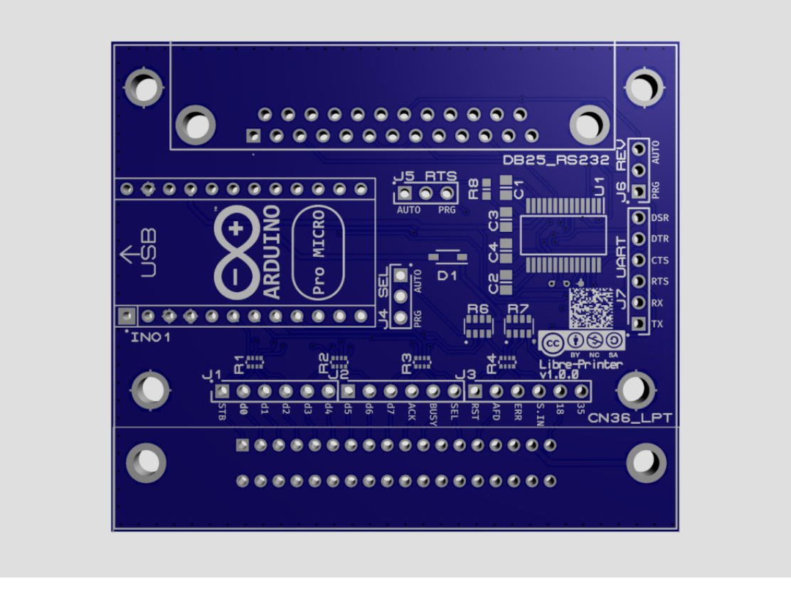

.. _interface_usage:

******************
Hardware Interface
******************

As it was mentioned in the project presentation chapter (:ref:`project_structure`),
|project_name| relies on an interface that receives the print data coming from
a computer.

.. figure:: _static/misc/v1.0.0_components.webp
   :scale: 60 %
   :align: center
   :alt: Libre-Printer hardware interface for parallel & serial printer emulation; 3D visualisation with components

   |project_name| interface (version 1.0.0)

.. contents:: Summary
    :depth: 2
    :local:
    :backlinks: top

LED indications
===============

The microcontroller of the interface is currently an Arduino ProMicro whose diagram below:

.. figure:: _static/pinouts/pro_micro_pinout_1.png
   :scale: 75 %
   :align: center
   :alt: Arduino ProMicro pinout

   Arduino ProMicro pinout

Here's how the LEDs of the Arduino behave:

================================================ ===========================================
**Power LED (green)**                            Lit as soon as the interface is powered on
**TX LED only (red)**                            Interface waiting for configuration
**RX LED flashes at a rate of 1/second (red)**   Interface ready to receive print data
**RX LED flashes briefly + TX LED continuously** Interface receiving data and relaying it
**TX LED + RX LED during ~7seconds**             Interface in boot mode after a manual reset
================================================ ===========================================

Datasheet & list of components
==============================

     3D visualisation without components

   |project_name| Printed Circuit Board design without components (version 1.0.0)

The files required to build the project's electronic board are available on
the Git repository in the `hardware <https://github.com/ysard/libre-printer>`_
folder.

TBA

Component roles & optional components
=====================================

In the vast majority of cases, **the interface can be used as is without requiring
modifications or additional components**.
However, the circuit offers customization options to accommodate implementations
that deviate from what was considered standard at the time.
Obviously, if only one of the two interfaces (serial or parallel) is needed,
the components related to the unused interface are dispensable.

It is important to understand that the
`IEEE 1284 standard <https://en.wikipedia.org/wiki/IEEE_1284>`_
for bidirectional parallel communications between computers and peripherals
was established in 1994. However, the parallel port and its connector,
released by Centronics, date back to the 1970s.
Twenty years have passed during which the interfaces and their implementations
evolved according to the manufacturers' desiderata for their models.

In parallel (no pun intended), the serial interface never benefited from
standardization, even as late as IEEE 1284.
The DB25 interfaces found on the IBM PC are RS232 serial interfaces,
which many mistakenly associate with what was known as a parallel port until the 2000s.

Thus, most DB25 cables are RS232 serial cables, used before
the 9-pin DE-9 connector (commonly called DB9) replaced them.

The DB25 connector is indeed a swampland of non-standard norms;
the straight 25-wire cable is quite rare.
Additionally, all combinations of pins and logical states for hardware
flow control have been used.
For example, the DTR/DSR, RTS/CTS, DTR+REV/DSR, DTR+REV/DSR+DCD pairs.
For example, while the DTR and REV pins are supposed to follow each other,
if it turns out that some machines use different states for them
(high or low state to signal available material),
then the number of possible combinations becomes very large.

 ===================== =========== =========== =======
  Component part no.    Optional    Parallel    Serial
 ===================== =========== =========== =======
  INO1                              x           x
  J1                    x           x
  J2                    x           x
  J3                    x           x
  J4                    x           x
  R1                    x*          x
  R2                    x*          x
  R3                    x*          x
  R4                    x*          x
  R6                    x*          x
  R7                    x*          x
  D1                    x*          x

  R8                    x                       x
  J5                    x                       x
  J6                    x                       x
  J7                    x                       x
  C1                                            x
  C2                                            x
  C3                                            x
  C4                                            x
  U1                                            x
 ===================== =========== =========== =======

\*: Normal parallel operation not guaranteed, see below.

Parallel Interface
-------------------

The parallel interface is present via the CN36_LPT connector.
Connectors J1, J2, and J3 are present for debugging or measurement purposes.

Standard Pins:
~~~~~~~~~~~~~~

Protection resistors R1, R2, R3, R4 and pullup resistors R6, R7, D1 *can* be omitted;
In this case, the first ones (R1-R4) must be bridged to allow the signals to pass.
While it's allowed for test cases, the interface *should work™* most of the time
but it's far from guaranteed...

Unused Pins:
~~~~~~~~~~~~

Some pins are not used or optional; thus ``Autofeed``, ``Reset``, ``SelectIn``
are not currently used although routed, protected, and kept high by
pull-up resistors R6 & R7.

Non-standard Pins:
~~~~~~~~~~~~~~~~~~

Non-standard pins, normally unassigned, can be kept
high because some equipments require it (cables or devices).
For example, the Commodore C64 seems to require a 5V voltage on pin 18.

Pin 35 may may also require a high state for some equipment.
The pad near pin 4 of resistor R7 should be connected for this purpose.

Options:
~~~~~~~~
- Jumper 4 - Signal Select (output)

  The ``Select`` pin signals to the computer that the printer is available,
  the voltage level required for this signal is 5V. ``Select`` can be controlled
  by the firmware;
  in this case, a connection between pins 2 and 3 of jumper J4 should be made
  (this is the default case).

  Otherwise, the interface should signal itself as a constantly connected printer.
  A bridge between pins 1 and 2 of jumper J4 should be made and the pull-up
  resistor R6 should be present.

Serial Interface
----------------

The serial interface is present via the DB25 RS232 connector.
The J7 connector is present for debugging purposes for the TTL levels (≤ 5V)
of the RS232 interface (so-called UART interface).

Options:
~~~~~~~~
- Jumper 5 - Signal RTS (output)

  Most serial printers require this pin to be high as soon as the printer
  is connected. As with the ``Select`` pin for the parallel interface, the state
  of this pin is configurable: Either from the firmware for hardware flow control
  (by connecting pins 2 and 3 as is the default),
  or fixed to high permanently via a pull-up resistor R8 (by connecting pins 1 and 2).

- Jumper 6 - Signal REV (output)

  The DTR signal indicates that the printer is ready to receive data, this signal
  is normally connected to the REV pin (non-standard in a DB25 RS232 cable).
  Most of the time, and normally, this signal is high logic; however, some
  equipments operate in low logic.
  Hence, the REV and DTR pins can adopt different logical states.

  Pins 2 and 3 of jumper 6 are connected by default for a REV pin that follows
  the logic of the DTR pin. Otherwise, REV should be controlled independently;
  a connection between pins 1 and 2 should be made at the expense of the default
  connection between 2 and 3.

License
=======

See the chapter :ref:`licenses`.
