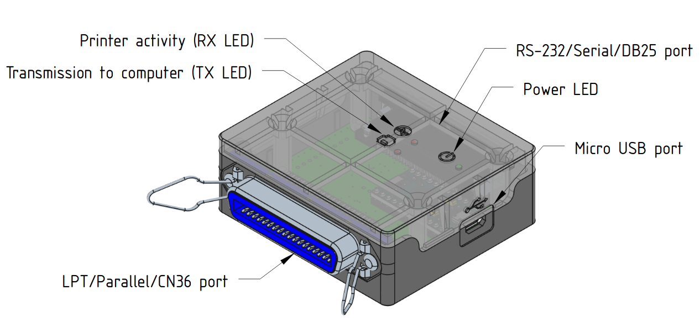

******************
Quick installation
******************

This section describes the fastest way to get a |project_name| interface working
on a GNU/Linux computer.

For the first installation, use the **Debian package**. Manual installation,
legacy converters and advanced configuration are described in the following sections.

1. Install Libre-Printer
========================

Download the latest `.deb` package from the
`GitHub releases <https://github.com/ysard/libre-printer/releases>`__.

Install it with:

.. code-block:: bash

    sudo apt install ./libre-printer_<version>_all.deb

The package installs the Libre-Printer service and its USB device detection rule.

2. Connect the interface
========================

Connect the Libre-Printer interface to the computer with USB.

The interface is automatically detected and the Libre-Printer service is started.

To check that the USB interface is visible, you can use:

.. code-block:: bash

    ls /dev/ttyACM*

The interface should appear as a serial USB device.

3. Use the default parallel interface
=====================================

By default, Libre-Printer is configured for a **parallel / Centronics printer**.

No change is required when using the parallel interface.

Connect the computer or equipment that normally sends data to the
`CN36_LPT` connector of the Libre-Printer interface.

4. Enable the serial interface (RS-232)
=======================================

The serial interface is **disabled by default**.

To use RS-232 instead of the parallel interface, edit:

`/etc/libre-printer/libreprinter.conf`

and enable the serial printer:

.. code-block:: ini

    [serial_printer]
    enabled=yes
    baudrate=19200
    flow_control=hardware

Set `baudrate` and `flow_control` to match the equipment you are connecting.

Make sure that the configured `serial_port` corresponds to the USB device
created by udev on your system.

5. Check the interface status
=============================

The LEDs provide a quick indication of the interface state:

* **Power LED on**: the interface is powered.
* **RX LED flashing regularly**: the interface is ready to receive the printing data.
* **RX flashing + TX on**: data is being received and processed.
* **TX and RX on for several seconds**: the interface is in boot mode after a
  manual reset and is waiting the libreprinter service.

Once the interface is ready, send a print job from the connected equipment.

6. Output
=========

By default, received data is processed by |project_name| and stored in its
output directories.

The default installation uses:

`/var/lib/libre-printer/`

See :ref:`service_configuration` to configure the printer emulation,
output format and optional redirection to a CUPS printer.

Troubleshooting
===============

If the interface is not detected, first check the USB connection and verify
that a `/dev/ttyACM*` device is present.

If the interface is detected but no data is received, verify the selected
interface type and, for RS-232, that the serial parameters match the connected
equipment.

For detailed hardware information, connector pinouts and advanced configuration,
see :ref:`interface_usage` and :ref:`service_configuration`.
